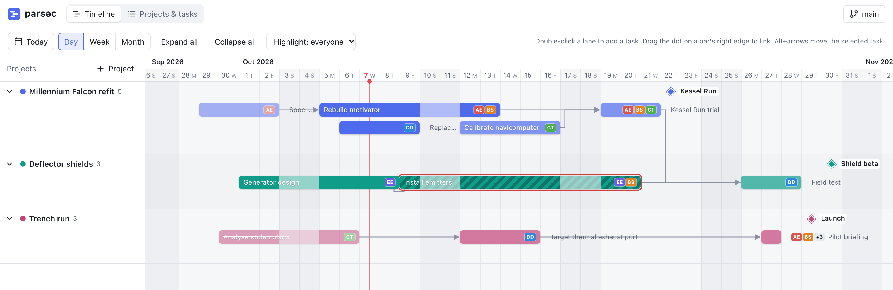

<p align="center">
  
</p>

<h1 align="center">parsec</h1>

Project task planning and timing, with a gantt timeline. Named after the unit of
time used to make the Kessel Run.

Data lives in a plain git repository as YAML files, so history, sync and backup
come from git.

<picture>
  <source media="(prefers-color-scheme: dark)" srcset="docs/screenshot-dark.png">
  
</picture>

## Features

- Timeline (gantt) with a swimlane per project; collapse or hide projects.
- Drag a bar to move it, drag its edges to change start/end dates.
- Concurrent tasks stack in rows. Drag a bar up/down (or Alt+Up/Down, or the
  arrows in the task panel) to reorder rows. Dropping onto an occupied row
  inserts a new row.
- Dependencies drawn as arrows (red when the predecessor ends on or after the
  successor starts). Drag the dot on a bar's right edge onto another bar to add
  one; click an arrow to remove it. Cycles are rejected.
- Weekends are non-working days by default: durations count working days,
  moving a task keeps its working-day length, start/end dates skip weekends,
  and weekend days inside a bar are faded. Tick "Works weekends" on a task to
  treat every day as a working day.
- Milestones per project, shown as diamonds with a marker line.
- Continuous horizontal scroll (the range grows as you scroll), day/week/month
  zoom, a Today button, and click-drag panning on empty space.
- Assignee initials on bars, in each person's colour (set in the people list;
  new people get the least-used palette colour). Short bars fall back to
  "first one or two + N" or a bare count.
- Highlight a person (or "Unassigned") on the timeline to fade every other
  task.
- Task panel: title, status, project, dates, estimate (hours), assignees,
  dependencies, description.
- Projects & tasks view: sortable, filterable task table, project editor
  (name, colour, description, milestones), people list.
- Git panel: changed files, commit, pull (rebase), push, sync, remote URL,
  history, abort a conflicted rebase.
- Light/dark theme follows the system setting.

## Running

Requires Go 1.22+, Node 20+ and git.

```sh
make build
./parsec --data ~/plans
```

Then open http://127.0.0.1:7343.

- `--data` is the data repository. It is created and `git init`ed if missing.
- `--addr` sets the listen address (default `127.0.0.1:7343`). There is no
  authentication; keep it on localhost.

Git operations use the system `git` binary, so existing SSH keys, credential
helpers and commit signing settings apply. Interactive prompts are disabled;
credentials must be available non-interactively.

## Development

```sh
make dev-server   # Go API on :7343, data in ./parsec-data
make dev-web      # Vite on :5173, proxies /api to :7343
make check        # go vet + svelte-check
make test         # Go tests
```

## Data layout

```
people.yaml
projects/<projectId>/project.yaml
projects/<projectId>/tasks/<taskId>.yaml
```

One file per task keeps diffs small and limits merge conflicts when several
people sync the same repository. Dates are inclusive `YYYY-MM-DD`. A task's
`lane` is its row within the project swimlane; overlapping lanes in the stored
data (e.g. after a merge) are resolved on display and fixed on the next edit.

View preferences (zoom, collapsed and hidden projects) are stored per browser,
not in the data repository.
